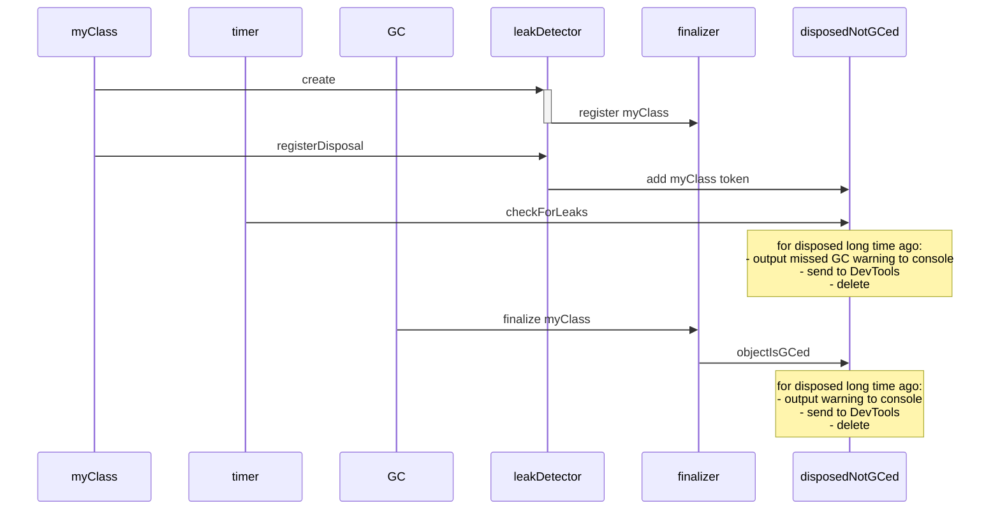

```mermaid
sequenceDiagram
    participant myClass
    participant timer
    participant GC

    myClass ->>+ leakDetector: create
    leakDetector ->>- finalizer: register myClass
    myClass ->> leakDetector: registerDisposal
    leakDetector ->> disposedNotGCed: add myClass token
    timer ->> disposedNotGCed: checkForLeaks
    Note over disposedNotGCed: for disposed long time ago:<br/>- output missed GC warning to console<br/>- send to DevTools<br/>- delete
    GC ->> finalizer: finalize myClass
    finalizer ->> disposedNotGCed: objectIsGCed
    Note over disposedNotGCed: for disposed long time ago:<br/>- output warning to console<br/>- send to DevTools<br/>- delete
    	 
```